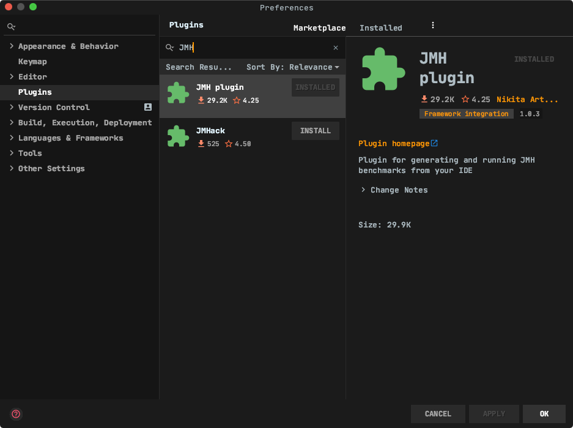

<!-- MarkdownTOC -->
- [1 重要概念](#j1)
  - [1.1 JMH是什么?](#j11)
  - [1.2 它能做什么？](#j12)
  - [1.3 为什么要用JMH?](#j13)
    - [1.3.1 常见测试案例的套路](#j131)
    - [1.3.2 JMH测试的套路](#j132)
    - [1.3.3 基准测试的特质](#j133)
    - [1.3.4 JMH的适用场景](#j134)
    - [1.3.5 哪些开源框架使用了JMH进行了性能测试？](#j135)
    - [1.3.6 为什么需要JMH总结](#j136)
- [2 环境搭建](#j2)
  - [2.1 Existing Maven projects have been imported](#j21)
    - [2.1.1 PackageSearch插件安装](#j211)
    - [2.1.2 添加JMH包的两种方式](#j212)
  - [2.2 Create based on ArcheType](#j22)
    - [2.2.1 Command line](#j221)
    - [2.2.2 JetBrains IDEA](#j222)
- [2.3 Plugin Install](#j23)
- [3 HelloWord](#j3)
   - [3.1 First JMH示例源码](#j31)
   - [3.2 执行结果（控制台报告详解）](#j32)
- [4 JMH实战入门](#j4)
   - [4.1 JMH的使用方式](#j41)
    - [4.1.1 基于API](#j411)
    - [4.1.2 基于注解](#j412)
- [5 常见案例](#j5)
- [6 注意事项](#j6)
- [7 OpenJDK Code Tools](#j7)
- [8 Source Code](#j8)
<!-- /MarkdownTOC -->

# <span id="j1">1 重要概念</span>
> 在日常开发中，我们对一些代码的调用或者工具的使用会存在多种选择方式，在不确定他们性能的时候，我们首先想要做的就是去测量它。大多数时候，我们会简单的采用多次计数的方式来测量，来看这个方法的总耗时。

> 但是，如果熟悉JVM类加载机制的话，应该知道JVM默认的执行模式是JIT编译与解释混合执行。JVM通过热点代码统计分析，识别高频方法的调用、循环体、公共模块等，基于JIT动态编译技术，会将热点代码转换成机器码，直接交给CPU执行。


> 也就是说，JVM会不断的进行编译优化，这就使得很难确定重复多少次才能得到一个稳定的测试结果？所以，很多有经验的同学会在测试代码前写一段预热的逻辑。

## <span id="j11">1.1 JMH是什么？</span>
JMH，即Java Microbenchmark Harness，这是专门用于进行代码的微基准测试的一套工具API。
JMH是用于构建，运行，分析Java或其他运行在JVM之上的语言的 纳秒/微秒/毫秒/宏观 级别基准测试的工具。  

何谓 Micro Benchmark 呢？ 简单地说就是在 method 层面上的 benchmark，精度可以精确到微秒级。

> 前世今生

- JMH的作者兼布道者 [Aleksey Shipilev](https://shipilev.net/)
- 2013年11月，首次发布
- 特色优势在于，它是由Oracle实现JIT即时编译器的团队研发
- 归于OpenJDK
- [The official website](https://openjdk.java.net/projects/code-tools/)

## <span id="j12">1.2 什么是基准测试？</span>
`基准测试`是指通过设计科学的测试方法、测试工具和测试系统，实现对一类测试对象的某项性能指标进行定量的和可对比的测试。  
可以简单的类比成我们电脑常用的鲁大师，或者手机常用的跑分软件安兔兔之类的性能检测软件。都是按一定的基准或者在特定条件下去测试某一对象的的性能，比如显卡、IO、CPU之类的。

## <span id="j13">1.3 为什么要用JMH？</span>

### <span id="j131">1.3.1 常见测试案例的套路</span>
- 准备代码
- 准备数据
- 维护线程
- 统计数据
- 对比结果

### <span id="j132">1.3.2 JMH测试的套路</span>
- 重要的事说三遍：测试内容、测试内容、测试内容
 
### <span id="j133">1.3.3 基准测试的特质</span>
- 可重复性  
可进行重复性的测试，这样做有利于比较每次的测试结果，得到性能结果的长期变化趋势，为系统调优和上线前的容量规划做参考。
- 可观测性  
通过全方位的监控（包括测试开始到结束，执行机、服务器、数据库），及时了解和分析测试过程发生了什么。
- 可展示性  
  相关人员可以直观明了的了解测试结果（web界面、仪表盘、折线图树状图等形式）。
- 真实性  
测试的结果反映了客户体验到的真实的情况（真实准确的业务场景+与生产一致的配置+合理正确的测试方法）。
- 可执行性  
相关人员可以快速的进行测试验证修改调优（可定位可分析）。

> 可见要做一次符合特质的基准测试，是很繁琐也很困难的。外界因素很容易影响到最终的测试结果。特别对于JAVA的基准测试。如果你有特定的场景针对性能有特别的需求，就可以使用JMH来做性能测试。JMH并不仅仅是测试人员需要了解的性能工具，针对Javaer也应该非常熟悉。 

### <span id="j134">1.3.4 JMH的适用场景</span>
1. 定量分析某个热点函数的优化效果
2. 想定量地知道某个函数需要执行多长时间，以及执行时间和输入变量的相关性
3. 对比一个函数的多种实现方式

### <span id="j135">1.3.5 哪些开源框架使用了JMH进行了性能测试？</span>
> 大部分涉及性能的开源框架都使用了JMH，如：
- [Netty](https://github.com/netty/netty/tree/fb50847e3941a8566b4386ff323299eb558ab918/microbench)
- [Kafka](https://github.com/apache/kafka/tree/trunk/jmh-benchmarks)
- [Zookeeper](https://github.com/apache/zookeeper/blob/92f23ecd8159fd8d9c2fb8f34dd94f680ee6f712/zookeeper-it/src/main/java/org/apache/zookeeper/server/watch/WatchBench.java)
- [HPPC](https://github.com/carrotsearch/hppc/tree/master/hppc-benchmarks)
- [JetBrains](https://github.com/JetBrains/xodus/tree/809a650b067a74ed5580280b4e5b13cd619dd6ee/benchmarks)

### <span id="j136">1.3.6 为什么需要JMH总结</span>
- 方便：使用方便，配置一些注解即可测试，且测量纬度、内置的工具丰富
- 专业：JMH自动地帮我们避免了一些测试上的“坑”，避免不了的也在例子中给出了说明
- 准确：预热、fork隔离、避免方法内联、避免常量折叠等很多方法可以提高测量的准确性

# <span id="j2">2 环境搭建</span>

## <span id="j21">2.1 Existing Maven projects have been imported</span>

```xml
<dependency>
    <groupId>org.openjdk.jmh</groupId>
    <artifactId>jmh-core</artifactId>
    <version>RELEASE</version>
</dependency>
<dependency>
    <groupId>org.openjdk.jmh</groupId>
    <artifactId>jmh-generator-annprocess</artifactId>
    <version>RELEASE</version>
    <scope>provided</scope>
</dependency>
```

### <span id="j211">2.1.1 PackageSearch插件安装</span>

> 介绍一种JetBrains IDEA（> 2020.2 Beta）快速导入包的方式，你现在可以完全放弃从[mvnrepository](https://mvnrepository.com/)等类似查找坐标的站点。记住一个全新的插件[Package Search](https://plugins.jetbrains.com/plugin/12507-package-search)。官方插件，目前还未完全集成于`IDEA`，需要独立安装。非常友好的支持`Gradle/Maven`项目，帮助你更好的维护`dependency`坐标的新增、查询以及版本更新。


### <span id="j212">2.1.2 添加JMH包的两种方式</span>


## <span id="j22">2.2 Create based on ArcheType</span>

### <span id="j221">2.2.1 Command line</span>

```shell
mvn archetype:generate \
          -DinteractiveMode=false \
          -DarchetypeGroupId=org.openjdk.jmh \
          -DarchetypeArtifactId=jmh-java-benchmark-archetype \
          -DgroupId=com.ly.samples.jmh \
          -DartifactId=jmh-archetype-samples \
          -Dversion=1.0
```

### <span id="j222">2.2.2 JetBrains IDEA</span>


### <span id="j23">2.3 Plugin Install</span>



# <span id="j3">3 HelloWord</span>

## <span id="j31">3.1 First JMH示例源码</span>

```java
package org.openjdk.jmh.samples;

import org.openjdk.jmh.annotations.Benchmark;
import org.openjdk.jmh.runner.Runner;
import org.openjdk.jmh.runner.RunnerException;
import org.openjdk.jmh.runner.options.Options;
import org.openjdk.jmh.runner.options.OptionsBuilder;

public class JMHSample_01_HelloWorld {

    @Benchmark
    public void wellHelloThere() {
        // this method was intentionally left blank.
    }

    public static void main(String[] args) throws RunnerException {
        Options opt = new OptionsBuilder()
                .include(JMHSample_01_HelloWorld.class.getSimpleName())
                .forks(1)
                .build();

        new Runner(opt).run();
    }
}
```

## <span id="j32">3.2 执行结果（控制台报告详解）</span>

```shell
# ::::::::::: JetBrains IDEA 执行Java类时的基本调用信息（Command Line模式不包含该信息） :::::::::::
/Users/xs/.sdkman/candidates/java/19.2.1-grl/bin/java -javaagent:/Users/xs/Library/Application Support/JetBrains/Toolbox/apps/IDEA-U/ch-0/202.6397.20/IntelliJ IDEA 2020.2 EAP.app/Contents/lib/idea_rt.jar=58454:/Users/xs/Library/Application Support/JetBrains/Toolbox/apps/IDEA-U/ch-0/202.6397.20/IntelliJ IDEA 2020.2 EAP.app/Contents/bin -Dfile.encoding=UTF-8 -classpath /Users/xs/.sdkman/candidates/java/19.2.1-grl/jre/lib/charsets.jar:/Users/xs/.sdkman/candidates/java/19.2.1-grl/jre/lib/ext/cldrdata.jar:/Users/xs/.sdkman/candidates/java/19.2.1-grl/jre/lib/ext/dnsns.jar:/Users/xs/.sdkman/candidates/java/19.2.1-grl/jre/lib/ext/jaccess.jar:/Users/xs/.sdkman/candidates/java/19.2.1-grl/jre/lib/ext/localedata.jar:/Users/xs/.sdkman/candidates/java/19.2.1-grl/jre/lib/ext/nashorn.jar:/Users/xs/.sdkman/candidates/java/19.2.1-grl/jre/lib/ext/sunec.jar:/Users/xs/.sdkman/candidates/java/19.2.1-grl/jre/lib/ext/sunjce_provider.jar:/Users/xs/.sdkman/candidates/java/19.2.1-grl/jre/lib/ext/sunpkcs11.jar:/Users/xs/.sdkman/candidates/java/19.2.1-grl/jre/lib/ext/zipfs.jar:/Users/xs/.sdkman/candidates/java/19.2.1-grl/jre/lib/jce.jar:/Users/xs/.sdkman/candidates/java/19.2.1-grl/jre/lib/jsse.jar:/Users/xs/.sdkman/candidates/java/19.2.1-grl/jre/lib/jvmci-services.jar:/Users/xs/.sdkman/candidates/java/19.2.1-grl/jre/lib/management-agent.jar:/Users/xs/.sdkman/candidates/java/19.2.1-grl/jre/lib/resources.jar:/Users/xs/.sdkman/candidates/java/19.2.1-grl/jre/lib/rt.jar:/Users/xs/.sdkman/candidates/java/19.2.1-grl/lib/dt.jar:/Users/xs/.sdkman/candidates/java/19.2.1-grl/lib/jconsole.jar:/Users/xs/.sdkman/candidates/java/19.2.1-grl/lib/sa-jdi.jar:/Users/xs/.sdkman/candidates/java/19.2.1-grl/lib/tools.jar:/Users/xs/Documents/pg/samples/jmh-sample/target/classes:/Users/xs/.m2/repository/org/openjdk/jmh/jmh-core/1.23/jmh-core-1.23.jar:/Users/xs/.m2/repository/net/sf/jopt-simple/jopt-simple/4.6/jopt-simple-4.6.jar:/Users/xs/.m2/repository/org/apache/commons/commons-math3/3.2/commons-math3-3.2.jar:/Users/xs/.m2/repository/org/openjdk/jmh/jmh-generator-annprocess/1.23/jmh-generator-annprocess-1.23.jar:/Users/xs/Documents/pg/samples/netty-in-action-samples/build/classes/java/main:/Users/xs/.gradle/caches/modules-2/files-2.1/io.netty/netty-all/4.1.51.Final/5e5f741acc4c211ac4572c31c7e5277ec465e4e4/netty-all-4.1.51.Final.jar:/Users/xs/Documents/pg/samples/netty-in-action-samples/build/classes/java/test:/Users/xs/.gradle/caches/modules-2/files-2.1/junit/junit/4.13/e49ccba652b735c93bd6e6f59760d8254cf597dd/junit-4.13.jar:/Users/xs/.gradle/caches/modules-2/files-2.1/org.hamcrest/hamcrest-core/1.3/42a25dc3219429f0e5d060061f71acb49bf010a0/hamcrest-core-1.3.jar:/Users/xs/.m2/repository/com/ly/flight/int/grab-ticket-facade/1.0.0.0-SNAPSHOT/grab-ticket-facade-1.0.0.0-20200713.032926-17.jar:/Users/xs/.m2/repository/com/ly/sof/sof-facade-base/2.4.1.6/sof-facade-base-2.4.1.6.jar:/Users/xs/.m2/repository/javax/ws/rs/javax.ws.rs-api/2.0/javax.ws.rs-api-2.0.jar:/Users/xs/.m2/repository/org/projectlombok/lombok/1.18.12/lombok-1.18.12.jar:/Users/xs/.m2/repository/org/slf4j/slf4j-api/1.7.13/slf4j-api-1.7.13.jar:/Users/xs/.m2/repository/org/apache/logging/log4j/log4j-slf4j-impl/2.12.1/log4j-slf4j-impl-2.12.1.jar:/Users/xs/.m2/repository/org/apache/logging/log4j/log4j-api/2.12.1/log4j-api-2.12.1.jar:/Users/xs/.m2/repository/org/apache/logging/log4j/log4j-core/2.12.1/log4j-core-2.12.1.jar:/Users/xs/.m2/repository/org/slf4j/jcl-over-slf4j/1.7.13/jcl-over-slf4j-1.7.13.jar:/Users/xs/Documents/pg/samples/maven-test1/target/classes org.openjdk.jmh.samples.JMHSample_01_HelloWorld

# ::::::::::: 环境、配置信息（JDK、JMH版本信息、基准测试配置） :::::::::::
# JMH version: 1.23
# VM version: JDK 1.8.0_232, OpenJDK 64-Bit GraalVM CE 19.2.1, 25.232-b07-jvmci-19.2-b03
# VM invoker: /Users/xs/.sdkman/candidates/java/19.2.1-grl/jre/bin/java
# VM options: -javaagent:/Users/xs/Library/Application Support/JetBrains/Toolbox/apps/IDEA-U/ch-0/202.6397.20/IntelliJ IDEA 2020.2 EAP.app/Contents/lib/idea_rt.jar=58454:/Users/xs/Library/Application Support/JetBrains/Toolbox/apps/IDEA-U/ch-0/202.6397.20/IntelliJ IDEA 2020.2 EAP.app/Contents/bin -Dfile.encoding=UTF-8
# Warmup: 5 iterations, 10 s each
# Measurement: 5 iterations, 10 s each
# Timeout: 10 min per iteration
# Threads: 1 thread, will synchronize iterations
# Benchmark mode: Throughput, ops/time
# Benchmark: org.openjdk.jmh.samples.JMHSample_01_HelloWorld.wellHelloThere

# ::::::::::: 每次执行明细报告 :::::::::::
# Run progress: 0.00% complete, ETA 00:01:40
# Fork: 1 of 1
# Warmup Iteration   1: 3213142022.784 ops/s
# Warmup Iteration   2: 3277888682.411 ops/s
# Warmup Iteration   3: 3595369632.535 ops/s
# Warmup Iteration   4: 3840237736.524 ops/s
# Warmup Iteration   5: 3737309817.525 ops/s
Iteration   1: 3873580137.416 ops/s
Iteration   2: 3824189687.757 ops/s
Iteration   3: 3570624837.751 ops/s
Iteration   4: 3662529127.704 ops/s
Iteration   5: 3818490226.960 ops/s

# ::::::::::: 汇总报告（包括最小值、平均值、最大值） :::::::::::
Result "org.openjdk.jmh.samples.JMHSample_01_HelloWorld.wellHelloThere":
  3749882803.518 ±(99.9%) 491970077.567 ops/s [Average]
  (min, avg, max) = (3570624837.751, 3749882803.518, 3873580137.416), stdev = 127763066.826
  CI (99.9%): [3257912725.951, 4241852881.084] (assumes normal distribution)


# Run complete. Total time: 00:01:41

REMEMBER: The numbers below are just data. To gain reusable insights, you need to follow up on
why the numbers are the way they are. Use profilers (see -prof, -lprof), design factorial
experiments, perform baseline and negative tests that provide experimental control, make sure
the benchmarking environment is safe on JVM/OS/HW level, ask for reviews from the domain experts.
Do not assume the numbers tell you what you want them to tell.

# ::::::::::: 基准测试的最终报告 :::::::::::
Benchmark                                Mode  Cnt           Score           Error  Units
JMHSample_01_HelloWorld.wellHelloThere  thrpt    5  3749882803.518 ± 491970077.567  ops/s

Process finished with exit code 0
```

# <span id="j4">4 JMH实战入门</span>
##  <span id="j41">4.1 JMH的使用方式

### <span id="j411">4.1.1 基于API

```java
import org.openjdk.jmh.runner.Runner;
import org.openjdk.jmh.runner.RunnerException;
import org.openjdk.jmh.runner.options.Options;
import org.openjdk.jmh.runner.options.OptionsBuilder;

/**
 *
 * 1. 这是benchmark 启动的入口
 * 2. 这里同时还完成了JMH测试的一些配置工作
 * 3. 默认场景下，JMH会去找寻标注了@Benchmark的方法，可以通过include和exclude两个方法来完成包含以及排除的语义
 */
public static void main(String[] args) throws RunnerException {
    Options opt = new OptionsBuilder()
            // 包含语义
            // 可以使用方法名，也可以使用 XXX.class.getSimpleName()
            .include("Helloworld")
            // 排除语义，同 include
            .exclude("Pref")
            // 预热10轮
            .warmupIterations(10)
            // 代表正式度量测试做10轮，
            // 而每次都是先执行完预热再执行正式度量，
            // 内容都是调用标注了@Benchmark的代码。
            .measurementIterations(10)
            // forks(3)指的是创建3个JVM进程，做3轮测试
            // 因为一次测试无法有效的代表结果，
            // 所以通过3轮测试较为全面的测试，
            // 而每一轮都是先预热，再正式计量。
            .forks(3)
            // 日志输出路径，也可以不输出到文件
            .output("/var/log/jmh/jmh_benchmark.log")
            .build();

    new Runner(opt).run();
}
```
### <span id="j412">4.1.2 基于注解

```java
    @Benchmark
    @Warmup(iterations = 5, time = 100, timeUnit = TimeUnit.MILLISECONDS)
    @Measurement(iterations = 5, time = 100, timeUnit = TimeUnit.MILLISECONDS)
    public double measure() {
        return Math.log(x1);
    }
```

## <span id="j41">4.2 常用注解</span>
> @AuxCounters

可以统计 @State 修饰的对象中的 public 属性被执行的情况，它的参数有两个
- `AuxCounters.Type.EVENTS` 统计发生的次数
- `AuxCounters.Type.OPERATIONS`  按我们指定的格式统计，如按吞吐量统计
CAVEAT:这是一个实验性的API  

> `@Benchmark`

指定基础测试的方法

> `@BenchmarkMode`

基准测试的模式
- `@Mode` 
  - `Throughput` 吞吐量：每单位时间的操作次数
  - `AverageTime` 平均时间：每个操作的平均时间
  - `SampleTime` 采样时间：采样每个操作的时间
  - `SingleShotTime` 单次执行时间：测量一次操作的时间
  - `All` 元模式：所有基准测试模式。对于内部JMH测试最有用

> CompilerControl

JMH提供了可以控制是否使用内联的注解
- `CompilerControl.Mode.DONT_INLINE` 不使用内联
- `CompilerControl.Mode.INLINE` 强制使用内联
- `CompilerControl.Mode.EXCLUDE` 不编译

> @Fork

指定代码运行时是否需要fork出一个JVM进程，如果在同一个JVM中测试则会相互影响，一般fork进程设置为1。本注解支持在method级或class级设置，如果在类上设置则当前基准测试类中的所有测试方法都有效，此注解有可能会被覆盖。运行时参数

> @Group

执行组

> @GroupThreads

GroupThreads定义了多少线程正在参与运行组中的特定Benchmark方法

> @Measurement

度量，其实就是一些基本的测试参数。iterations进行测试的轮次，time每轮进行的时长，timeUnit时长单位。都是一些基本的参数，可以根据具体情况调整。一般比较重的东西可以进行大量的测试，放到服务器上运行

> @OperationsPerInvocation

一次调用的操作数，这里的调用指的是jmh框架对某个method做一次benchmark，操作这里指的是for的内层子句。一般方法内存在for时需要使用，这对结果的影响很大

> @OutputTimeUnit

指定输出的时间单位，传入`java.util.concurrent.TimeUnit`中的时间单位，最小精确到纳秒级

> @Param

允许使用一份基准测试代码跑多组数据，特别适合测量方法性能和参数取值的关系

> @Setup

用于基准测试前的初始化动作

> @TearDown

用于基准测试后的动作

> @Level

`@Setup`、`@TearDown` 中使用
- `Trial` Benchmark级别：在每次运行基准测试之前/之后执行。
- `Iteration` 迭代级别：在基准的每次迭代之前/之后执行。
- `Invocation` 调用级别：每次执行基准测试方法时都要执行。

> `@State`

标记状态对象，用于多线程的测试，JMH可以像Spring一样自动注入这些变量
- `@Scope`
  - `Benchmark` 作用域为本次JMH测试，线程共享
  - `Group` 作用域为Group
  - `Thread` 作用域为线程，可以理解为一个ThreadLocal变量

> @Threads

线程注释提供了要运行的默认线程数

> @Timeout

允许设置基准测试的默认超时参数

> @Warmup

预热模式
- `WarmupMode.INDI` 每个Benchmark单独预热
- `WarmupMode.BULK` 在每个Benchmark执行前都预热所有的Benchmark
- `WarmupMode.BULK_INDI` 在每个Benchmark执行前都预热所有的Benchmark，且需要再预热本次执行的Benchmark

## <span id="j42">4.2 如何使用JMH内置的性能剖析工具查看基准测试消耗在什么地方</span>
具体的剖析方式内置的有如下几种：
- `ClassloaderProfiler`：类加载剖析
- `CompilerProfiler`：JIT编译剖析
- `GCProfiler`：GC剖析
- `StackProfiler`：栈剖析
- `PausesProfiler`：停顿剖析
- `HotspotThreadProfiler`：Hotspot线程剖析
- `HotspotRuntimeProfiler`：Hotspot运行时剖析
- `HotspotMemoryProfiler`：Hotspot内存剖析
- `HotspotCompilationProfiler`：Hotspot编译剖析
- `HotspotClassloadingProfiler`：Hotspot 类加载剖析

# <span id="j5">5 常见案例</span>

> 对比`java.util.ArrayList.add(E)`与`java.util.LinkedList.add(E)`性能案例

```java
import java.util.ArrayList;
import java.util.LinkedList;
import java.util.List;
import java.util.concurrent.TimeUnit;

import org.openjdk.jmh.annotations.Benchmark;
import org.openjdk.jmh.annotations.BenchmarkMode;
import org.openjdk.jmh.annotations.Fork;
import org.openjdk.jmh.annotations.Level;
import org.openjdk.jmh.annotations.Measurement;
import org.openjdk.jmh.annotations.Mode;
import org.openjdk.jmh.annotations.OutputTimeUnit;
import org.openjdk.jmh.annotations.Scope;
import org.openjdk.jmh.annotations.Setup;
import org.openjdk.jmh.annotations.State;
import org.openjdk.jmh.annotations.TearDown;
import org.openjdk.jmh.annotations.Warmup;

@BenchmarkMode(Mode.Throughput)
@OutputTimeUnit(TimeUnit.SECONDS)
@Warmup(iterations = 1, time = 1)
@Measurement(iterations = 1, time = 1)
@Fork(1)
public class ListBenchmark {

    @State(Scope.Thread)
    public static class ArrayClass {
        public List<String> list;

        @Setup(Level.Trial)
        public void setup() {
            list = new ArrayList<>();
        }

        @TearDown
        public void tearDown() {
            System.out.println("arrayList size:" + list.size());
        }
    }

    @State(Scope.Thread)
    public static class LinkedClass {
        public List<String> list;

        @Setup(Level.Trial)
        public void setup() {
            list = new LinkedList<>();
        }

        @TearDown
        public void tearDown() {
            System.out.println("linkedList size:" + list.size());
        }
    }

    @Benchmark
    public List<String> testArray(ArrayClass arrayClass) {
        arrayClass.list.add("1");
        return arrayClass.list;
    }

    @Benchmark
    public List<String> testLinked(LinkedClass linkedClass) {
        linkedClass.list.add("1");
        return linkedClass.list;
    }
}
```

> 相关案例
[详解JMH38个官方案例](https://www.jianshu.com/p/a5b9865257f4)
[JMH与8个测试陷阱](https://www.cnkirito.moe/java-jmh/)

# <span id="j6">6 注意事项</span>
JMH 基准测试需要注意的几个点：
- JMH只适合细粒度的方法测试，并不适用于系统之间的链路测试
- 环境应该尽量的纯净，任何一个点的影响都会影响最终的测试结果（如果对测试结果有非常高的要求时）
- 使用IDE的方式测试，无法使用`Debug`模式（本身就不支持，Debug模式实现了`JDWP`协议，IDE一般会跟踪很多Debug信息，间接会影响测试的精度）
- 测试前一定需要预热，预热的次数越多精度越高
- 了解JVM的一些陷阱，如：方法内联、常量折叠、死码消除、正确的使用循环、伪共享与缓存行等等
- 某些场景还得考虑硬件与操作系统的影响

# <span id="j7">7 OpenJDK Code Tools</span>
- asmtools – Assembler Tools (JAsm/JDis and JCod/JDec)
- btrace – Dynamic Java bytecode tracing tool
- defpath – Mercurial extension to edit default path settings
- doccheck – Utility to check HTML files in the JDK documentation
- friday-stats – Small utilities for analyzing OpenJDK
- jcheck – Mercurial changeset validator
- jcov – Code Coverage Tool
- jcstress – Java Concurrency Stress tests
- jemmy – UI test automation library
- jmh – Java Microbenchmark Harness
- jmh-jdk-microbenchmarks – JMH JDK microbenchmarks
- jol – Java Object Layout
- jtharness – JavaTest Harness
- jtreg – Regression Test Harness for the OpenJDK platform: jtreg
- sigtest – Signature Checking Tools
- trees – Mercurial extension for managing multiple repositories
- webrev – Tool to generate web-based diffs for code reviews

# <span id="j8">8 Source Code</span>


